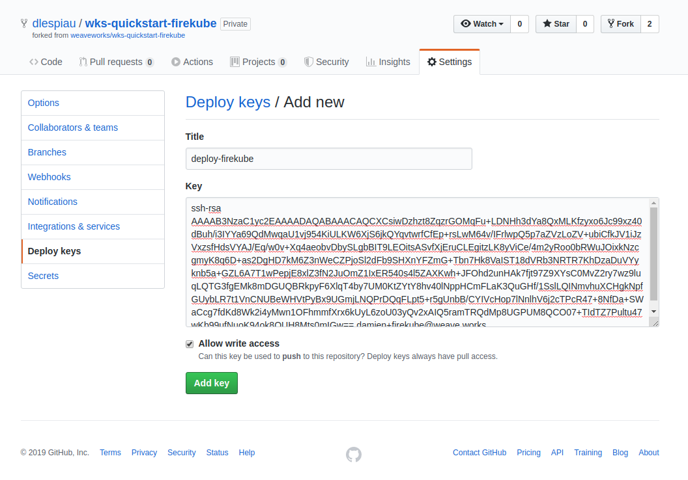

# Firekube

Firekube is a Kubernetes cluster working on top of [ignite][gh-ignite] and
[firecracker][gh-firecracker]. Firekube clusters are operated with
[GitOps][ww-gitops].

[ignite][gh-ignite] and [firecracker][gh-firecracker] only work on Linux as
they need [KVM][kvm]. Fortunately we also offer a mode where the Kubernetes
nodes are running inside containers which will on both Linux and macOS.

## Creating a Firekube cluster

1. Fork this repository.

1. Clone your fork and `cd` into it:

   ```console
   git clone git@github.com:$user/wks-quickstart-firekube.git
   cd wks-quickstart-firekube
   ```

1. Create an SSH key pair:

   ```console
   ssh-keygen -t rsa -b 4096 -C "damien+firekube@weave.works" -f deploy-firekube  -N ""
   ```

1. Upload the deploy to your fork (with read/write access):

   

1. (optional) If you are on macOS or want to use docker containers instead of [firecracker][gh-firecracker] virtual machines, change the backend to `docker` in `config.yaml`:

   ```console
   # Change backend: ignite to backend: docker in config.yaml
   vim config.yaml
   git add config.yaml
   git commit -m "Change backend to docker"
   ```

1. Start the cluster:

   ```console
   cd wks-quickstart-firekube
   ./setup.sh --git-deploy-key  ./deploy-firekube
   ```

   This step will take several minutes.

1. Export the `KUBECONFIG` environment variable as indicated at the end of the installation:

   ```console
   export KUBECONFIG=/home/damien/.wks/weavek8sops/example/kubeconfig
   ```

Enjoy your Kubernetes cluster!

   ```console
   $ kubectl get nodes
   NAME               STATUS   ROLES    AGE     VERSION
   67bb6c4812b19ce4   Ready    master   3m42s   v1.14.1
   a5cf619fa058882d   Ready    <none>   75s     v1.14.1
   ```

[gh-ignite]: https://github.com/weaveworks/ignite
[gh-firecracker]: https://github.com/firecracker-microvm/firecracker
[kvm]: https://en.wikipedia.org/wiki/Kernel-based_Virtual_Machine
[ww-gitops]: https://www.weave.works/technologies/gitops/